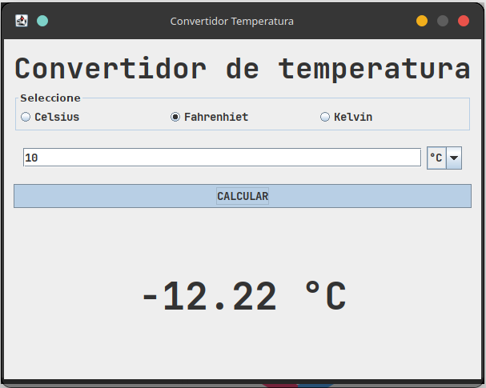
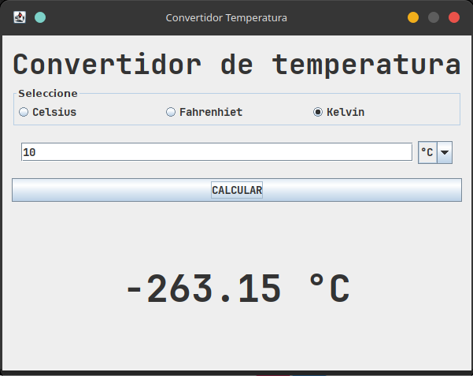
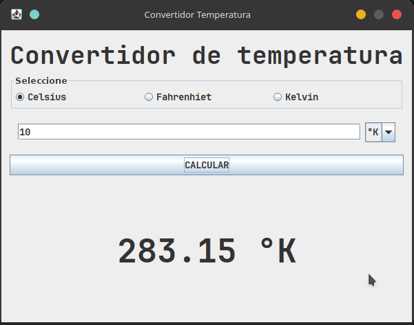

# Convertidor de Temperatura

Aplicación de escritorio desarrollada en **Java Swing** con **Apache NetBeans 25** y **Maven** para convertir temperaturas entre las escalas **Celsius**, **Fahrenheit** y **Kelvin**.

## Capturas de pantalla

| Selección de unidad origen | Ingreso de valor y resultado | Conversión completada |
|:---:|:---:|:---:|
|  |  |  |

## Características

- Conversión entre Celsius, Fahrenheit y Kelvin (6 combinaciones posibles)
- Interfaz gráfica intuitiva con radio buttons y combo box dinámico
- Resultados formateados con 2 decimales
- Ventana no redimensionable, centrada en pantalla
- Look & Feel Nimbus

## Tecnologías

- **Java 25** (target `maven.compiler.release`)
- **Maven** — gestión de dependencias y construcción
- **Swing** — interfaz gráfica de usuario
- **Apache NetBeans 25** — IDE con GUI Builder

## Cómo ejecutar

### Con Maven

```bash
mvn clean compile exec:java
```

### Desde NetBeans

1. Abrir el proyecto en NetBeans 25
2. Hacer clic derecho sobre el proyecto → `Run`

## Cómo usar

1. Seleccionar la unidad de **origen** (Celsius, Fahrenheit o Kelvin) mediante los radio buttons
2. El combo box se actualiza automáticamente con las unidades de **destino** disponibles
3. Ingresar el valor numérico a convertir
4. Presionar **CALCULAR**
5. El resultado se muestra en formato `XX.XX °X`

## Licencia

Distribuido bajo la licencia MIT. Ver `LICENSE` para más información.

## Autor

**xizuth**
