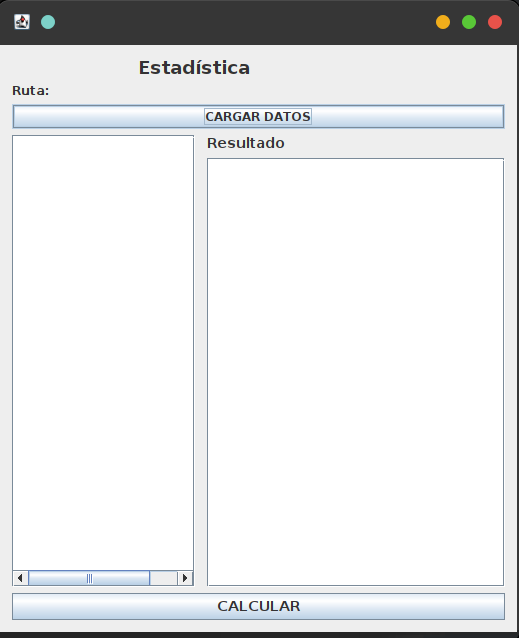
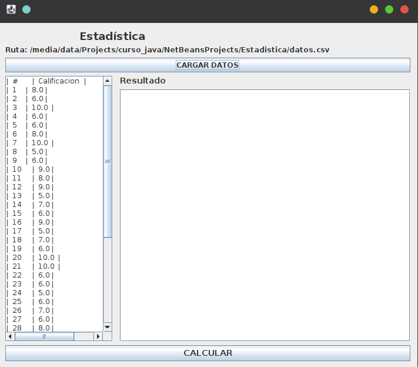
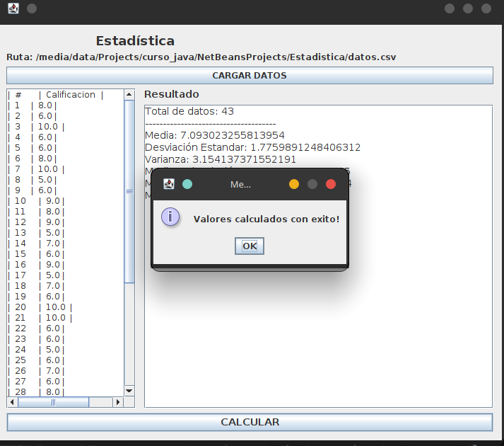
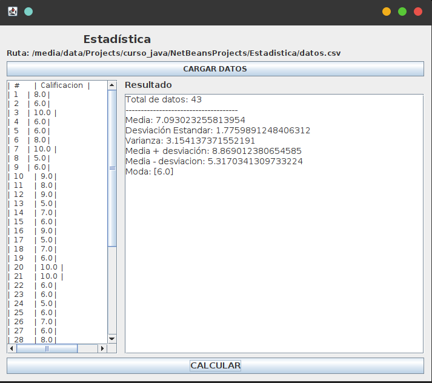

# Estadística

Aplicación de escritorio para cálculos estadísticos desarrollada en **Java 25** con **Apache NetBeans 25** y **Swing**.

## Características

- Carga de datos desde archivos CSV
- Cálculo de **media aritmética**
- Cálculo de **desviación estándar** poblacional
- Cálculo de **varianza**
- Cálculo de **moda** (soporta multimodalidad)
- Interfaz gráfica intuitiva con look and feel Nimbus

## Capturas de pantalla

| Ventana principal | Carga de datos |
|:---:|:---:|
|  |  |

| Cálculo de resultados | Resultado final |
|:---:|:---:|
|  |  |

## Requisitos

- **Java 25** o superior
- **Apache Maven**
- **Apache NetBeans 25** (opcional)

## Instalación y ejecución

### Con Maven

```bash
git clone <repo-url>
cd Estadistica
mvn clean compile exec:java
```

### Con NetBeans

1. Abrir NetBeans 25.
2. `File → Open Project` y seleccionar la carpeta `Estadistica`.
3. Dar clic derecho sobre el proyecto → `Run`.

## Uso

1. Haz clic en **CARGAR DATOS** y selecciona un archivo CSV (ej. `datos.csv`).
2. Los datos cargados se muestran en la tabla izquierda.
3. Haz clic en **CALCULAR**.
4. Los resultados (media, desviación estándar, varianza, moda) aparecen en el panel derecho.

### Formato del archivo CSV

La primera línea se toma como título o encabezado. Las líneas siguientes deben contener un valor numérico cada una:

```
Calificacion
8
6
10
...
```

## Estructura del proyecto

```
Estadistica/
├── pom.xml                          # Configuración Maven (Java 25)
├── datos.csv                        # Datos de ejemplo
├── stati_1.png                      # Capturas de pantalla
├── stati_2.png
├── stati_3.png
├── stati_4.png
└── src/main/java/com/estadistica/app/
    ├── Estadistica.java             # Punto de entrada
    ├── MainWindow.java              # Interfaz gráfica (Swing)
    ├── Statistic.java               # Lógica estadística
    └── ReadData.java                # Lector de archivos CSV
```

## Clases principales

| Clase | Descripción |
|-------|-------------|
| `Estadistica.java` | Clase principal con el método `main` |
| `MainWindow.java` | Ventana principal con la interfaz Swing |
| `Statistic.java` | Cálculos: media, desviación estándar, varianza, moda |
| `ReadData.java` | Lectura de datos desde archivos CSV |

## Licencia

MIT
