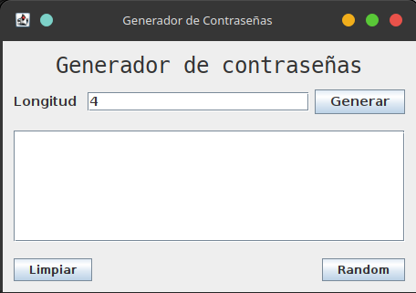
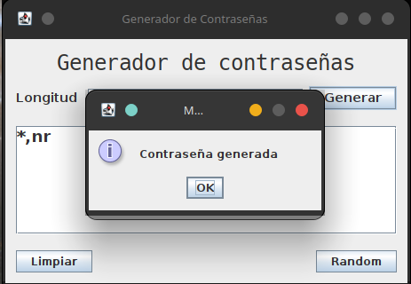
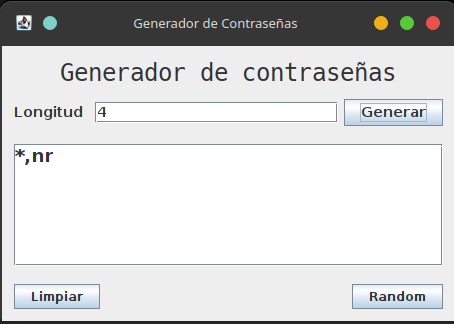
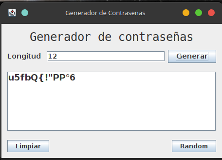
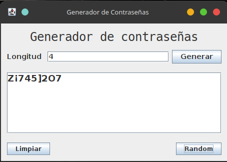

# 🔐 GeneradorPassword


Aplicación de escritorio en **Java 25** con **Swing** para generar contraseñas seguras y aleatorias. Desarrollada con **Apache NetBeans 25** y **Maven**.

---

## 📸 Capturas de pantalla

| Ventana principal | Generar contraseña | Confirmación |
|:-:|:-:|:-:|
|  |  |  |

| Longitud aleatoria | Limpiar campos |
|:-:|:-:|
|  |  |

---

## ✨ Características

- **Longitud personalizable** – ingresa la cantidad de caracteres deseada.
- **Longitud aleatoria** – genera una contraseña de entre **4 y 19** caracteres.
- **Cuatro categorías de caracteres**:
  - Letras minúsculas (`a–z`)
  - Letras mayúsculas (`A–Z`)
  - Números (`0–9`)
  - Símbolos especiales (`|!"#$%&/()=¿?¡]*_:;,.-{}+'°¬~`)
- **Interfaz limpia** con Nimbus Look and Feel.
- **Botón Limpiar** – restablece los valores por defecto al instante.

---

## 📋 Requisitos

- **Java 25** o superior ([Descargar](https://jdk.java.net/25/))
- **Apache Maven 3.9+** ([Descargar](https://maven.apache.org/download.cgi))
- (Opcional) **Apache NetBeans 25** ([Descargar](https://netbeans.apache.org/download/index.html))

---

## 🚀 Compilar y ejecutar

### Con Maven

```bash
# Compilar y empaquetar
mvn clean package

# Ejecutar el JAR generado
java -jar target/GeneradorPassword-1.0-SNAPSHOT.jar
```

### Con NetBeans

1. Abrir el proyecto: *File → Open Project* → seleccionar `GeneradorPassword`.
2. Hacer clic en **Run** (o presionar `F6`).

---

## 📁 Estructura del proyecto

```
GeneradorPassword/
├── pom.xml                              # Configuración Maven
├── README.md                            # Este archivo
├── pass_1.png … pass_5.png              # Capturas de pantalla
├── src/
│   └── main/
│       └── java/
│           └── com/
│               └── temperature/
│                   └── app/
│                       └── generadorpassword/
│                           ├── GeneradorPassword.java   # Punto de entrada
│                           ├── MainWindow.java          # Interfaz gráfica (JFrame)
│                           ├── MainWindow.form          # Diseñador de NetBeans
│                           └── Password.java            # Lógica de generación
└── target/                              # Archivos compilados
```

---

## 🧩 Clases principales

| Clase | Descripción |
|-------|-------------|
| `GeneradorPassword.java` | `main()` – lanza la ventana principal |
| `MainWindow.java` | `JFrame` con botones **Generar**, **Random** y **Limpiar** |
| `Password.java` | Algoritmo que construye la contraseña a partir de 4 categorías de caracteres |

---

## 👤 Autor

**xizuth**

---

## 📄 Licencia

Proyecto con fines **educativos**. Distribuido bajo la licencia MIT. Ver [LICENSE](LICENSE) para más detalles.
