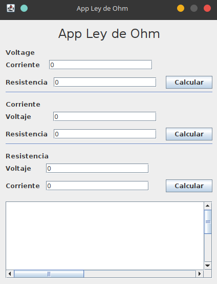
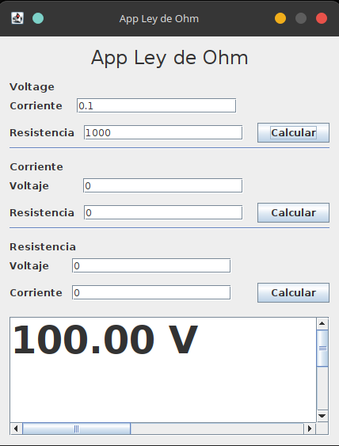
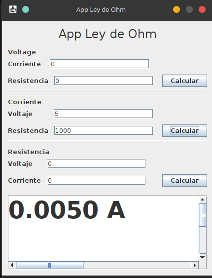
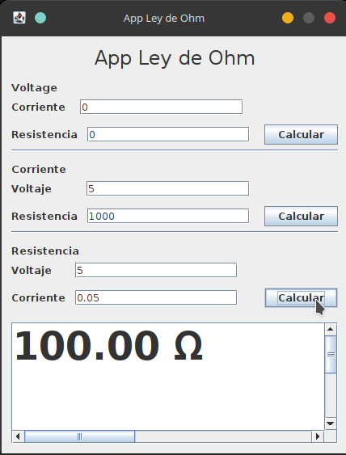

# ⚡ Ley Ohm

Aplicación educativa en **Java 25** con interfaz gráfica **Swing** para calcular la **Ley de Ohm** (V = I × R). Desarrollada con **Apache NetBeans 25** y **Maven**.

## Capturas de pantalla

| Ventana principal | Cálculo de Voltaje (V = I × R) |
|:-:|:-:|
|  |  |

| Cálculo de Corriente (I = V / R) | Cálculo de Resistencia (R = V / I) |
|:-:|:-:|
|  |  |

## Características

- **Cálculo de Voltaje** — V = I × R (ingresa Corriente y Resistencia)
- **Cálculo de Corriente** — I = V / R (ingresa Voltaje y Resistencia)
- **Cálculo de Resistencia** — R = V / I (ingresa Voltaje y Corriente)
- Interfaz gráfica con **Nimbus Look & Feel**
- Resultados en fuente grande (48pt) en un área de texto dedicada
- Diseño limpio y ordenado con separadores entre secciones

## Requisitos

| Herramienta | Versión |
|-------------|---------|
| Java JDK | 25 o superior |
| Apache NetBeans | 25 (recomendado) |
| Maven | 3.9+ |
| Sistema operativo | Windows / Linux / macOS |

## Cómo ejecutar

### Desde Apache NetBeans

1. Abrir NetBeans 25
2. `File → Open Project` → seleccionar la carpeta `LeyOhm`
3. Presionar `F6` (Run) o hacer clic en el botón ▶

### Desde terminal (Maven)

```bash
mvn clean package
java -jar target/LeyOhm-1.0.jar
```

### Desde terminal (compilación manual)

```bash
javac -d bin src/main/java/com/leyohm/app/leyohm/*.java
java -cp bin com.leyohm.app.leyohm.LeyOhm
```

## Cómo usar la aplicación

1. En la sección **Voltaje**, ingresa los valores de *Corriente* (I) y *Resistencia* (R), luego presiona **Calcular** para obtener V.
2. En la sección **Corriente**, ingresa los valores de *Voltaje* (V) y *Resistencia* (R), luego presiona **Calcular** para obtener I.
3. En la sección **Resistencia**, ingresa los valores de *Voltaje* (V) y *Corriente* (I), luego presiona **Calcular** para obtener R.
4. El resultado se muestra automáticamente en el área de texto inferior.

## Estructura del proyecto

```
LeyOhm/
├── pom.xml                          ← Configuración Maven
├── LICENSE                          ← Licencia MIT
├── README.md                        ← Este archivo
├── ohm_1.png .. ohm_4.png           ← Capturas de pantalla
└── src/
    └── main/
        └── java/
            └── com/
                └── leyohm/
                    └── app/
                        └── leyohm/
                            ├── LeyOhm.java       ← Punto de entrada (main)
                            ├── Ohm.java           ← Lógica de cálculos
                            ├── Principal.java     ← Interfaz gráfica (JFrame)
                            └── Principal.form     ← Diseño visual (NetBeans)
```

### Clases principales

| Clase | Descripción |
|-------|-------------|
| `LeyOhm.java` | Clase principal con el método `main()`. Crea y muestra la ventana centrada en pantalla. |
| `Ohm.java` | Contiene la lógica de negocio con los tres cálculos: `calculateVoltage()`, `calculateCurrent()`, `calculateResistance()`. |
| `Principal.java` | JFrame con la interfaz gráfica usando `GroupLayout`. Maneja los eventos de los botones y muestra los resultados. |

## Licencia

Este proyecto está bajo la **Licencia MIT**. Consulta el archivo [LICENSE](LICENSE) para más detalles.

---
*Proyecto educativo — autor: [xizuth](https://github.com/xizuth)*
