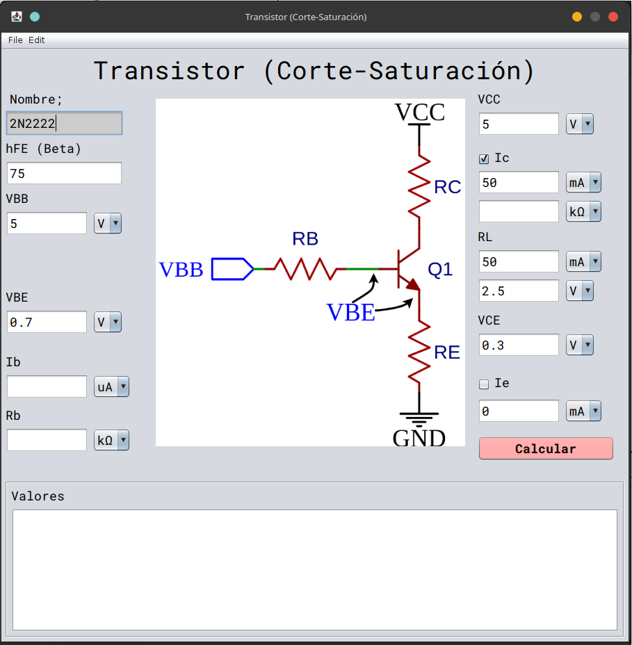
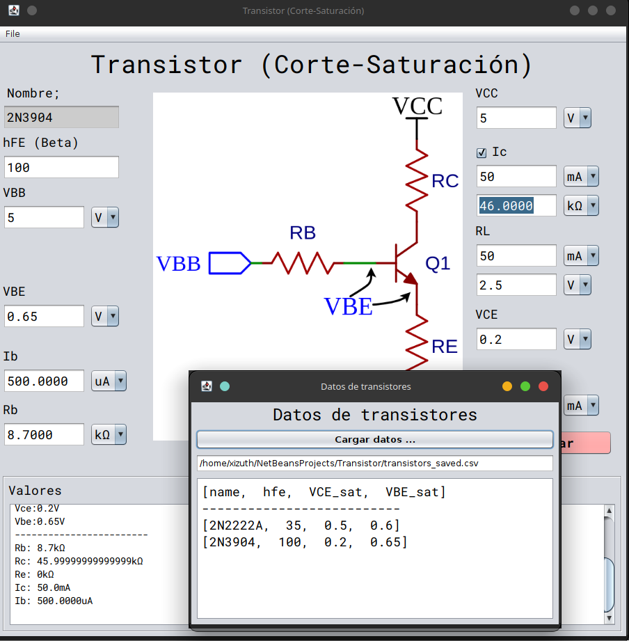

# Transistor (Corte-Saturación)

Aplicación de escritorio en **Java 25** con **Swing** para el cálculo de resistencias de polarización de transistores bipolares (BJT) en modo **corte-saturación**. Desarrollada con **Apache NetBeans 25** y **Maven**.



---

## Características

- Cálculo de **Rb** (resistencia de base) y **Rc** (resistencia de colector)
- Cálculo de **Ib** (corriente de base) e **Ic** (corriente de colector)
- Conversión automática entre unidades (V, mA, µA, kΩ)
- Carga y guardado de datos de transistores desde archivos **CSV**
- Interfaz gráfica con look and feel **Nimbus**
- Visualización de resultados detallados



---

## Requisitos

- **Java 25** o superior
- **Apache Maven** 3.x
- **Apache NetBeans 25** (opcional, para desarrollo)

---

## Cómo construir y ejecutar

### Con Maven

```bash
mvn clean package
java -jar target/Transistor-1.0-SNAPSHOT.jar
```

### Con NetBeans

1. Abrir el proyecto en NetBeans 25
2. Hacer clic en **Run** (F6)

---

## Estructura del proyecto

```
Transistor/
├── pom.xml
├── screen1.png
├── screen2.png
├── transistores.csv
├── transistors_saved.csv
└── src/main/java/com/transistor/app/
    ├── transistor/
    │   └── Transistor.java          # Punto de entrada
    ├── ui/
    │   ├── MainWindow.java          # Ventana principal
    │   └── DataTrasistorWindow.java # Ventana de datos CSV
    ├── lib/
    │   ├── Calculate.java           # Fórmulas de polarización
    │   ├── CONST.java               # Constantes y conversiones
    │   └── ReadTransistorData.java  # Lector/escritor CSV
    └── assets/
        └── tr.png                   # Icono del transistor
```

---

## Uso

1. Ingresar los valores del transistor: **nombre**, **hFE (β)**, **VBB**, **VBE**
2. Ingresar los valores del circuito: **VCC**, **Ic (RL)**, **VRL**, **VCE**
3. Presionar **Calcular**
4. Los resultados de **Rb**, **Rc**, **Ib** e **Ic** se muestran en pantalla
5. Usar el menú *File → Datos* para cargar/guardar datos desde CSV

### Fórmulas implementadas

```
Ib  = Ic / β
Rb  = (VBB - VBE) / Ib
Rc  = (VCC - VRL - VCE) / Ic
```

---

## Licencia

Este proyecto fue creado con fines educativos. Ver el archivo [LICENSE](LICENSE) para más detalles.
