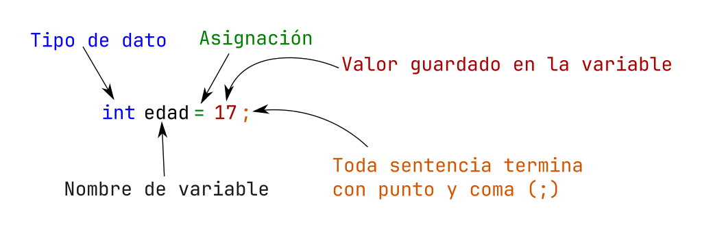

# ¿Cómo se declaran las variables ?

Cada lenguaje tiene su sintaxis de declaración de variables, en nuestro que es `JAVA`, es la siguiente manera:

Sintaxis:

```java
tipoDeVariable nombreVariable;  // declaración de variable
tipoDeVariable nombreVariable = valorAsignado; // declaración de variable y asignación
```

Ejemplos:

```java
int edad = 10;
double altura = 1.4;
char simbolo = '@';
boolean isLleno = true; // se debe importar el header <stdbool.h>
String nombre =  "Programacion en JAVA";
```
A continuación se muestra todas las partes de declaración de variable:



## Declaración de constantes

En ocasiones necesitamos declarar una variable que nunca cambie su valor, para eso existe que se vuelva constante, en el caso de `JAVA`, se cuenta con la palabra reservada `final` al momento de declarar la variable. Esto lo que hace que una vez sea declarada, nunca mas podrá cambiar su valor.

La forma de declarar una constante es la siguiente:

```java
final tipo_de_dato NOMBRE = valor;
```

Observe que ahora la convención de Camel Case indica que una constante debe ser nombrada en mayúsculas, en caso de contar con mas de 2 palabras se van separando con guion bajo (`_`). Con ello, al momento de verla sabremos que es una constante y ese valor no se puede modificar.

```java
final double PI = 3.141592; // declaramos la constante de pi
final int MAYOR_DE_EDAD = 18; // declaramos el valor para una constante para comprar cuando sea mayor de edad, este valor pues nunca cambiara
```

